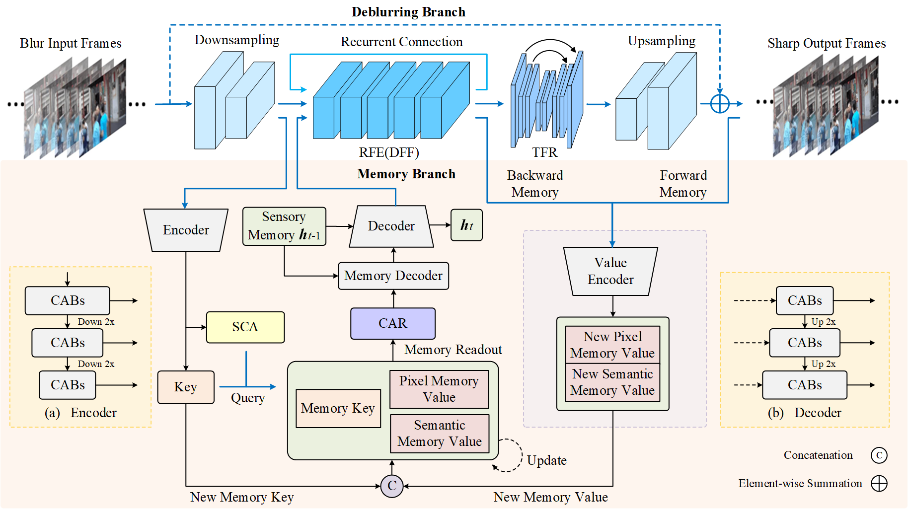

# RMemVD: A Simple Restricted Multi-Memory Bank for Video Deblurring

This repository is the Pytorch implementation of [RMemVD: A Simple Restricted Multi-Memory Bank for Video Deblurring](https://ieeexplore.ieee.org/document/11016086), appearing in TCE 2025.



## Prerequisites

- Python 3.8
- PyTorch >1.9.1
- Torchvision >0.10.1
- pyyaml
- opencv-python
- tensorboard
- tqdm
- lmdb
- scikit-image
- thop
- matplotlib

## Training
Please download and unzip the dataset file for each benchmark.

- [GOPRO](https://drive.google.com/file/d/1y4wvPdOG3mojpFCHTqLgriexhbjoWVkK/view?usp=sharing)
- [DVD](http://www.cs.ubc.ca/labs/imager/tr/2017/DeepVideoDeblurring/)
- [BSD](https://drive.google.com/drive/folders/1LKLCE_RqPF5chqWgmh3pj7cg-t9KM2Hd?usp=sharing)

To train the model on the GOPRO dataset, run the below command:
```
python main.py --config config/rmemvd_gopro.yml
```

To train the model on the DVD dataset, run the below command:
```
python main.py --config config/rmemvd_dvd.yml
```

To train the model on the BSD dataset, run the below command:
```
python main.py --config config/rmemvd_bsd.yml
```


## Evaluation
To evaluate the model on the GOPRO dataset, please **turn on the `test_only` option in the config file** and run the below command:
```
python main.py --config config/rmemvd_gopro.yml
```

To evaluate the model on the DVD dataset, please **turn on the `test_only` option in the config file** and run the below command:
```
python main.py --config config/rmemvd_dvd.yml
```

To evaluate the model on the BSD dataset, please **turn on the `test_only` option in the config file** and run the below command:
```
python main.py --config config/rmemvd_bsd.yml
```


## TODO
We plan to update our method in the near future.


## Credits
Our codes are modified from [MemDeblur](https://github.com/jibo27/MemDeblur). We thank for their excellent work!